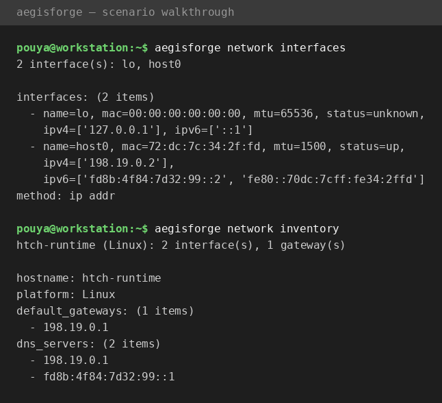
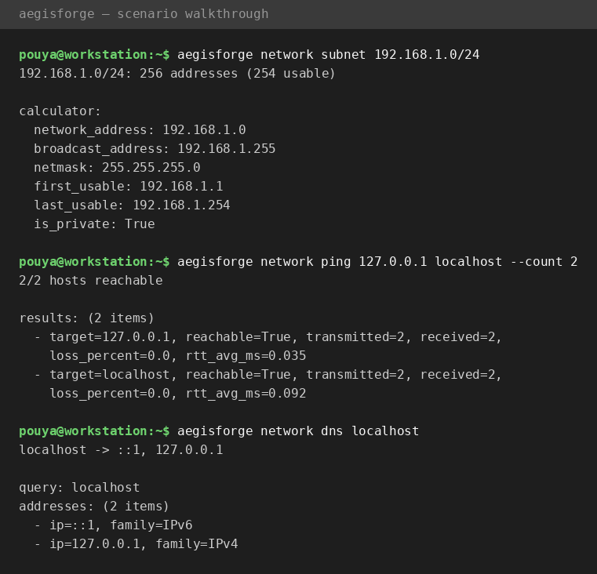
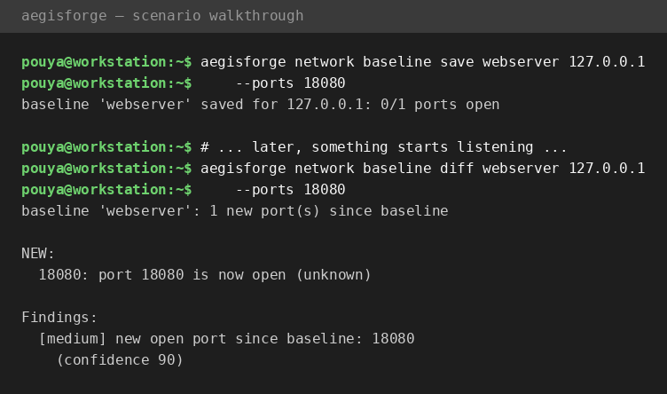
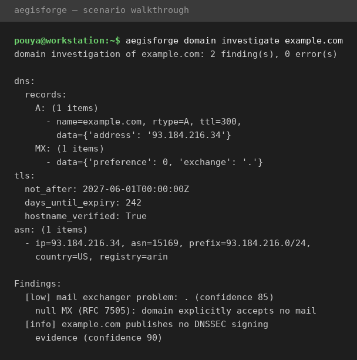
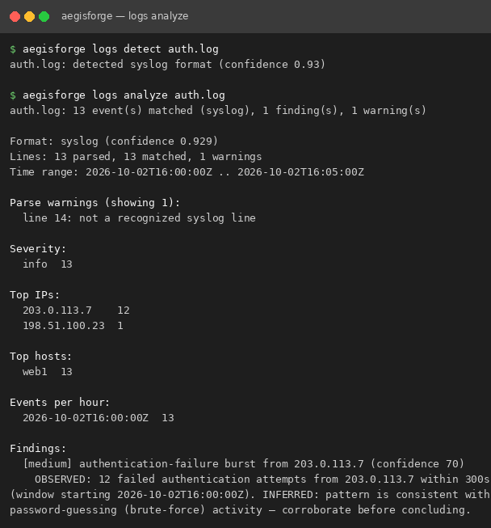
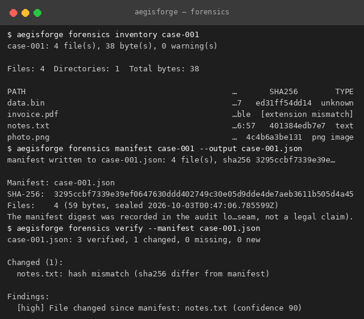
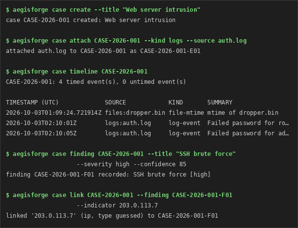

# AegisForge in action — scenario walkthrough

> **Scenario:** you've just been given access to a machine on a network
> nobody documented. Before you touch anything else, build a picture of
> where you are and what's around you — passively, without scanning
> anything you don't own.
>
> Every command below is real output from AegisForge v0.1.0.

## Step 1 — Where am I?

Start with your own interfaces, then pull the full local asset record:
hostname, gateways, DNS servers.

```
$ aegisforge network interfaces
$ aegisforge network inventory
```



You now know the machine's addresses, its gateway, and which DNS servers
it uses. That is the foundation everything else builds on.

## Step 2 — What does this address space look like?

Take the network you found yourself on and map it out. The subnet
calculator shows usable range, broadcast, and netmask — the boundaries
of "your" network.

```
$ aegisforge network subnet 192.168.1.0/24
192.168.1.0/24: 256 addresses (254 usable)

calculator:
  network_address: 192.168.1.0
  broadcast_address: 192.168.1.255
  netmask: 255.255.255.0
  first_usable: 192.168.1.1
  last_usable: 192.168.1.254
  is_private: True
```

## Step 3 — Who's alive?

Check reachability of explicit targets with bounded, concurrent pings.
AegisForge never sweeps a subnet unprompted — you name the targets.

```
$ aegisforge network ping 127.0.0.1 localhost --count 2
2/2 hosts reachable

results: (2 items)
  - target=127.0.0.1, reachable=True, transmitted=2, received=2,
    loss_percent=0.0, rtt_avg_ms=0.035
  - target=localhost, reachable=True, transmitted=2, received=2,
    loss_percent=0.0, rtt_avg_ms=0.092
```



## Step 4 — Who are they, by name?

Resolve names to addresses and addresses back to names:

```
$ aegisforge network dns localhost
localhost -> ::1, 127.0.0.1

query: localhost
addresses: (2 items)
  - ip=::1, family=IPv6
  - ip=127.0.0.1, family=IPv4
```

## Take it further — machine-readable output

Every command also emits the same result as structured data for
automation, dashboards, or evidence files:

```
$ aegisforge network ping 127.0.0.1 --count 1 --json
$ aegisforge network subnet 192.168.1.0/24 --csv
```

JSON follows a stable envelope (`tool`, `version`, `command`,
`timestamp`, `status`, `summary`, `data`, `findings`, `events`) with
exit codes `0` = ok, `1` = findings, `2` = error.

## What's next — v0.2: authorized scanning and change detection

> **Scenario continues:** a week later, you want to know if anything
> changed on that machine. Save a baseline, then rescan and diff.

Scanning is an *active* step, so AegisForge makes you name your target
explicitly — and refuses public IPs unless you pass `--allow-remote`
to confirm you're authorized:

```
$ aegisforge network scan 127.0.0.1 --ports 22,80,443
127.0.0.1 (127.0.0.1): 0/3 ports open

PORT   STATE     SERVICE     BANNER
22     closed
80     closed
443    closed
```

Save the known-good state, then let the diff catch drift:

```
$ aegisforge network baseline save webserver 127.0.0.1 --ports 18080
baseline 'webserver' saved for 127.0.0.1: 0/1 ports open

$ # ... later, something starts listening ...

$ aegisforge network baseline diff webserver 127.0.0.1 --ports 18080
```



The diff doesn't just print the change — it raises a proper finding
with severity and confidence, ready for the case timeline. Scan
results include service banners, TLS certificate details, and
HTTP metadata where available.

## What's next — v0.3: domain investigation

> **Scenario continues:** the scan found a web server, and now you
> want the full picture on its domain — who runs it, how mail and DNS
> are set up, whether the certificate is healthy.

One command runs every passive lookup and consolidates the report:

```
$ aegisforge domain investigate example.com
domain investigation of example.com: 2 finding(s), 0 error(s)
```



Behind that summary: A/AAAA/MX/NS/TXT/SOA/CNAME records (via a
stdlib DNS wire client — `socket` alone can't query MX or TXT),
reverse DNS for each address, nameserver resolution with lame
delegation flags, MX preference ordering, DNSSEC *presence* (reported,
never claimed as validated), TLS certificate inspection on 443,
RDAP registration data with WHOIS fallback, ASN ownership via Team
Cymru, and HTTP/HTTPS header + redirect chains. For a single record
type, `aegisforge domain dns example.com --type MX` is the quick
version.

Unlike port scanning, all of this is passive directory lookups —
nothing is sent to the target that its public services don't already
answer for anyone, so there's no `--allow-remote` gate here.

## What's next — v0.5: log analysis

> **Scenario continues:** the domain checks out, but the server's
> auth log tells a different story. Point AegisForge at the log file
> — it detects the format, parses it streaming, and hunts for
> trouble.

```console
$ aegisforge logs detect auth.log
auth.log: detected syslog format (confidence 0.93)

$ aegisforge logs analyze auth.log
auth.log: 13 event(s) matched (syslog), 1 finding(s), 1 warning(s)
```



Behind that summary: syslog (RFC 3164/5424), Apache/Nginx, JSON
lines, Windows Event XML exports and `key=value` parsers — all
streaming, so multi-gigabyte files never get loaded into memory.
Malformed lines become warnings with line numbers instead of
crashing the parse. Analysis builds a UTC timeline, severity and
HTTP-status histograms, top talkers, error extraction with context
lines, and burst detection. Detections keep the observed-vs-inferred
discipline you see above: 12 failed logins is *observed*; calling it
brute-force is *inferred* — and labeled as such.

Filters compose freely — `--since`, `--until`, `--level`,
`--contains`/`--not-contains`, `--host`, `--limit` — and because logs
carry PII, `--redact` masks IPs and emails in the output while the
source file stays untouched:

```console
$ aegisforge logs analyze auth.log --redact --since 2026-10-02T16:00:00Z
```

## What's next — v0.4: digital forensics

> **Scenario continues:** the logs point at a compromised laptop. You
> image its drive to `case-001/` — before anything else, AegisForge
> inventories every file and seals the result in an evidence manifest.
> Days later, you verify the copy still matches.

```console
$ aegisforge forensics inventory case-001
case-001: 4 file(s), 38 byte(s), 0 warning(s)

$ aegisforge forensics manifest case-001 --output case-001.json
manifest written to case-001.json: 4 file(s), sha256 3295ccbf7339e39e…

$ aegisforge forensics verify --manifest case-001.json
case-001.json: 3 verified, 1 changed, 0 missing, 0 new
```



The inventory is **read-only** — files are opened for reading only,
never modified, moved, or deleted. Each file is identified by magic
bytes first (30+ signatures); when no signature matches, the extension
is used as a clearly-labeled fallback, and a magic/extension
disagreement (like `invoice.pdf` above carrying an MZ header) is
flagged as an observed fact, not a verdict. Hashing is single-pass and
streaming — SHA-256, MD5 and SHA-1 computed in one chunked read, so
multi-gigabyte images never blow up memory.

The manifest is sealed with a SHA-256 over its canonical encoding,
stored inside the document and recorded in the audit log — a
tamper-evidence seam, not a claim of legal admissibility. Verification
re-hashes the live tree and reports changed / missing / new files,
each as a finding with the observed-vs-inferred discipline: a hash
mismatch is *observed*; calling it tampering is *inferred*.

Rounding out the module: `forensics duplicates` groups byte-identical
files by SHA-256, and `forensics timeline` lists mtime/atime/ctime
chronologically — labeled as filesystem metadata, not content claims.
Unreadable files and dangling symlinks become warnings, never
crashes, and directory symlinks are never followed.

## What's next — v0.6: the incident-response engine

> **Scenario continues:** the brute-force burst and the suspicious
> binary are not isolated curiosities — they are one incident. You
> open a case, attach the auth log and the binary as evidence, and
> let AegisForge merge everything into a single timeline.

```console
$ aegisforge case create --title "Web server intrusion"
case CASE-2026-001 created: Web server intrusion

$ aegisforge case attach CASE-2026-001 --kind logs --source auth.log
attached auth.log to CASE-2026-001 as CASE-2026-001-E01 (sha256 f2ca5a8b11029155…)

$ aegisforge case attach CASE-2026-001 --kind files --source dropper.bin
attached dropper.bin to CASE-2026-001 as CASE-2026-001-E02 (sha256 842e109b9642998c…)

$ aegisforge case timeline CASE-2026-001
CASE-2026-001: 4 timed event(s), 0 untimed event(s)

TIMESTAMP (UTC)             SOURCE            KIND       SUMMARY
2026-10-03T01:09:24.721914Z files:dropper.bin file-mtime mtime of dropper.bin
2026-10-03T02:10:01Z        logs:auth.log     log-event  Failed password for root from 203.0.113.7
2026-10-03T02:10:05Z        logs:auth.log     log-event  Failed password for admin from 203.0.113.7

$ aegisforge case finding CASE-2026-001 --title "SSH brute force" \
    --severity high --confidence 85
finding CASE-2026-001-F01 recorded: SSH brute force [high]

$ aegisforge case link CASE-2026-001 --finding CASE-2026-001-F01 \
    --indicator 203.0.113.7
linked '203.0.113.7' (ip, type guessed) to CASE-2026-001-F01
```



Attaching **copies** the file into the case — the source is opened
read-only and never modified, moved, or deleted — and records its
SHA-256 alongside the original path and the UTC attach time. The
unified timeline merges every evidence kind into one chronological
stream with per-event source labels: log events come from the logs/
auto-detection and streaming parsers, file mtimes from the forensics/
inventory, and network scan events from AegisForge JSON result
envelopes. Anything without a parseable timestamp lands in a separate
untimed section — listed, never silently dropped.

Findings get `CASE-2026-001-F01`-style IDs and move through
`open` → `investigating` → `resolved` / `false-positive`. Indicators
link to findings with their type guessed from the value's shape
(ip / domain / hash / url / email) unless you pass `--type` — and the
record always says which happened, because a guess is not a
classification. Notes are append-only, and closing a case requires a
closing `--note`, so the resolution is always on the record.

`case report` assembles the reproducible bundle — case metadata,
evidence manifest, timeline (JSON + CSV), findings, notes — plus a
report manifest with the SHA-256 of every artifact, so anyone can
verify the bundle hasn't changed since it was generated.
